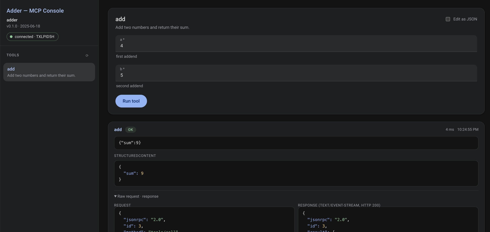

# mcpconsole

An embeddable, schema-driven web console for
[MCP](https://modelcontextprotocol.io) servers, in one line of Go:

```go
mux := http.NewServeMux()
mux.Handle("/mcp", mcpHandler)                 // any MCP streamable-HTTP handler
mux.Handle("/ui/", mcpconsole.Handler("/mcp")) // this library
```

The UI is generated entirely from the MCP protocol definition: it initializes a
session, calls `tools/list`, and renders an input form for each tool from its
JSON input schema.

The library has no Go dependencies apart from the standard library. All frontend
assets are embedded.



## Usage

```go
import "github.com/bilus/mcpconsole"

func main() {
	server := mcp.NewServer(&mcp.Implementation{Name: "adder", Version: "0.1.0"}, nil)
	mcp.AddTool(server, /* … */)

	mux := http.NewServeMux()
	mux.Handle("/mcp", mcp.NewStreamableHTTPHandler(
		func(*http.Request) *mcp.Server { return server }, nil))
	mux.Handle("/ui/", mcpconsole.Handler("/mcp", mcpconsole.WithTitle("Adder - MCP Console")))
	log.Fatal(http.ListenAndServe("localhost:8080", mux))
}
```

### Options

| Option | Effect |
| --- | --- |
| `WithTitle(string)` | Page title. Default `"MCP Console"`. |

## Schema coverage

The form renderer is deliberately conservative: it builds native controls for
what it can represent faithfully and falls back to a raw-JSON editor for
everything else.

| Schema construct |
| --- |
| `string` |
| `number` / `integer` |
| `boolean` |
| `enum` / `const` (scalars) |
| `array` of primitives/enums |
| nested `object` |
| `required`, `description`, `default` |
| `oneOf` / `anyOf` / `allOf` / `not` / `$ref` / `if`–`then` / union types / `patternProperties` / map-style objects / arrays of objects / depth > 4 * |

* JSON fallback

## Testing

Unit tests:

``` sh
go test ./...
```

Browser tests (require a local Chrome/Chromium):

``` sh
cd examples
go test -tags e2e ./...
```

## License

MIT, see [LICENSE](LICENSE).
